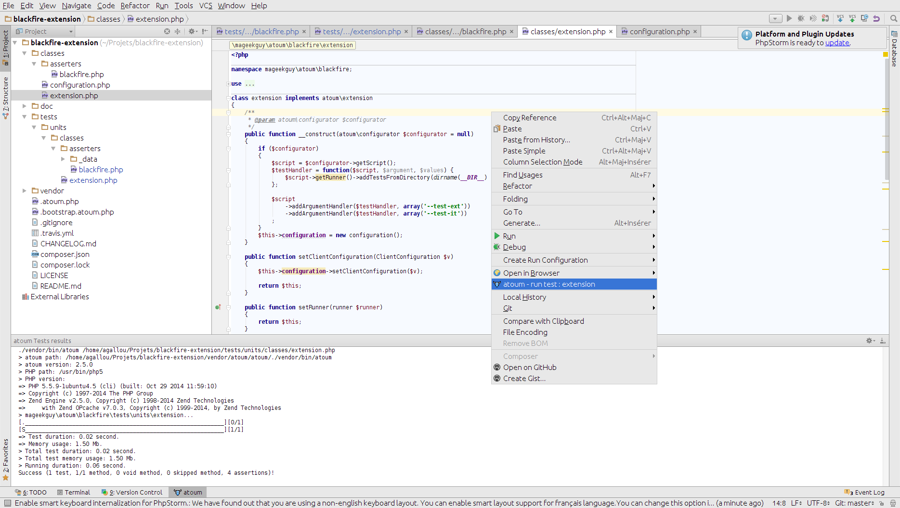

# atoum PhpStorm Plugin

Integrates atoum into PhpStorm

## Features

### Go to the test class from the tested class

* From the tested class you can go to the test class from a menu entry in navigation

* Or by an entry bin the right click menu

* Or by clicking on the icon on the left of the class

### Go to the tested class from the test class

* From the test class you can go to the tested class from a menu entry in navigation

* Or by an entry bin the right click menu

* Or by clicking on the icon on the left of the class

### Execute test inside PhpStorm

* By an entry on the run menu and on the right click menu

* You can run the tests from both the test file or the tested classe's file

### Easily identify test file by a custom icon

Atoum's test files are displayed with a different icon, like that you will easily differentiate them from other PHP files.

## Installation

* Download the lasted version of the `.jar` on the [releases pages](https://github.com/agallou/phpstorm-plugin/releases)
* Open PhpStorm
* Go to `File -> Settings`, then click on `Plugins`
* Click on the `install from disk` button, then select to downloaded jar
* Restart PhpStorm

## Links

* [PhpStorm](https://www.jetbrains.com/phpstorm/)
* [atoum](http://atoum.org)
* [atoum's documentation](http://docs.atoum.org)

## Licence

atoum phpstorm-plugin is released under the MIT License. See the bundled LICENSE file for details.
