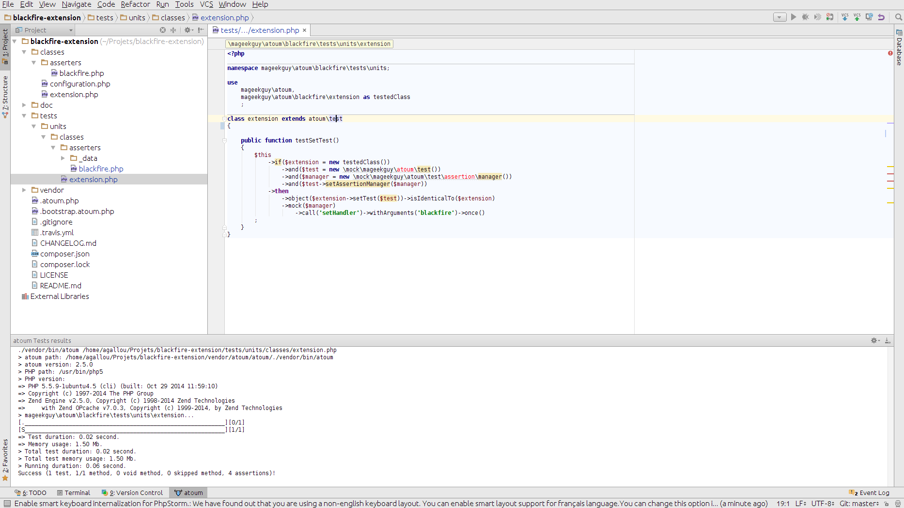
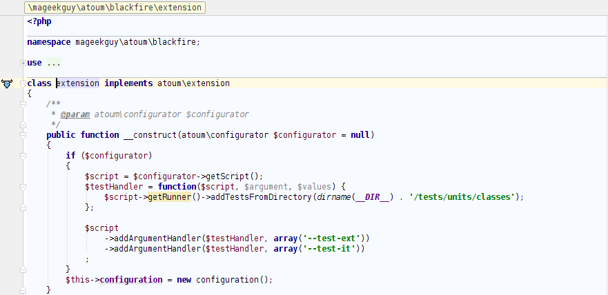
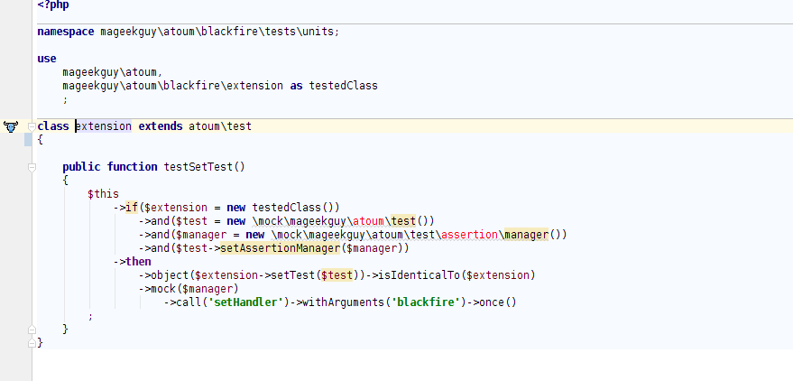
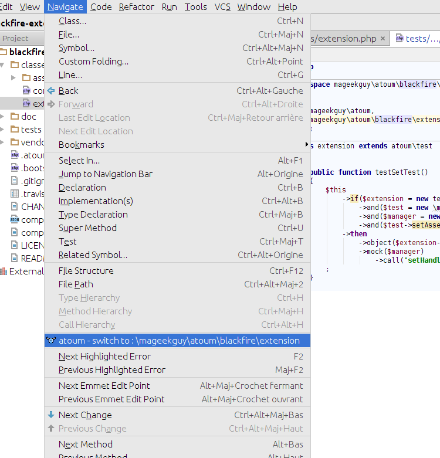
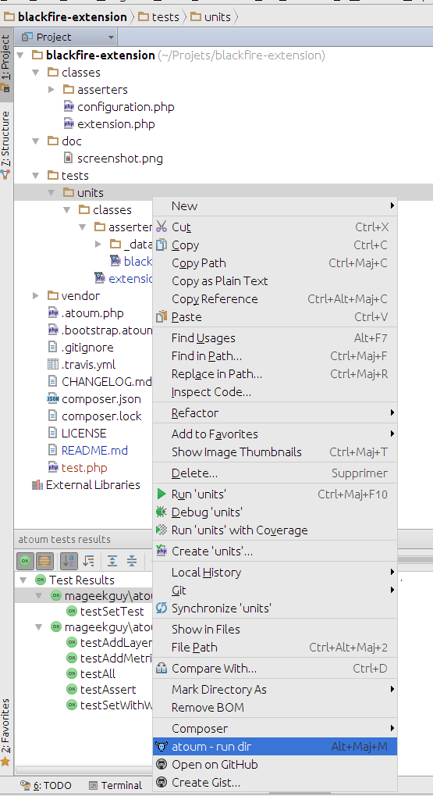
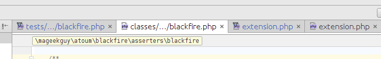
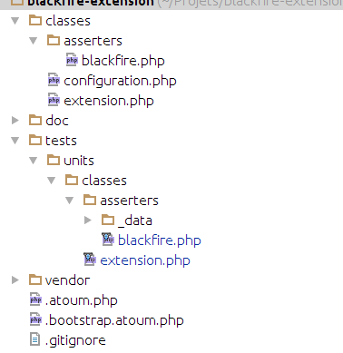
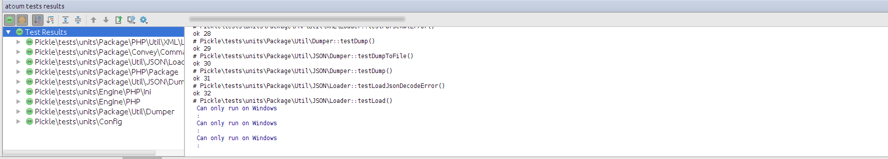
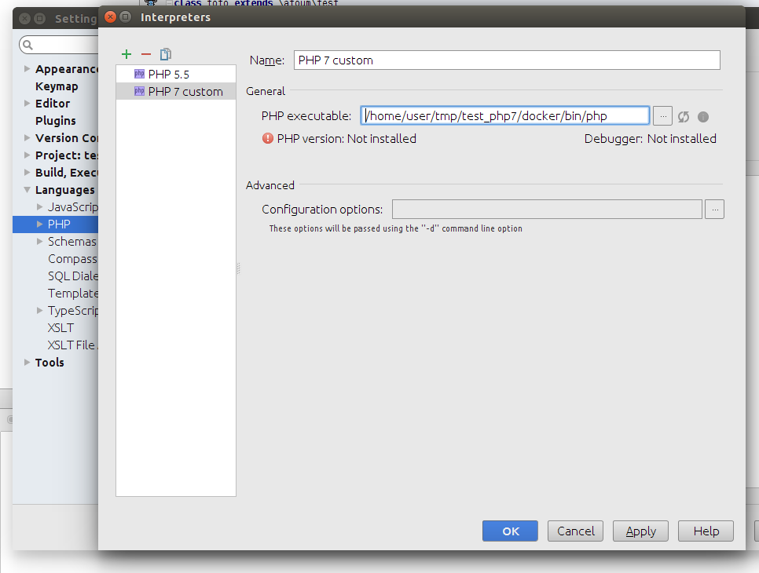

# atoum PhpStorm Plugin [](https://travis-ci.org/atoum/phpstorm-plugin) 

Integrates atoum into PhpStorm.

Features :

* Go to the test class from the tested class (shortcut: alt+shift+K)
* Go to the tested class from the test class (shortcut: alt+shift+K)
* Execute tests inside PhpStorm (shortcut: alt+shift+M)
* Execute all project's test inside PhpStorm (shortcut: alt+shift+V)
* Easily identify test files by a custom icon


## Detailed Features


### Execute tests inside PhpStorm

By an entry on the run menu and on the right click menu.



You can run the tests from both the test file or the tested classe's file.

Your test file and tested file will automatically be save before running the test.

The default keyboard shortcut to execute the test is alt+shift+M.


### Go to the test class from the tested class

From the tested class you can go to the test class by clicking on the icon on the left of the class,



or from a menu entry in navigation,


or by an entry bin the right click menu.


The default keyboard shortcut to switch file is alt+shift+K.


### Go to the tested class from the test class

From the test class you can go to the tested class by clicking on the icon on the left of the class,



or from a menu entry in navigation,



or by an entry bin the right click menu.


The default keyboard shortcut to switch file is alt+shift+K.

You can also run the test on the project view. From here you can launch tests on an entire directory:




### Easily identify test files by a custom icon

Atoum's test files are displayed with a different icon, like that you will easily differentiate them from other PHP files.






### Execute all tests inside PhpStorm

The plugin lets you run all your project's test suites inside PhpStorm. You can run them by selecting "run -> atoum - run all tests" (or with the default keyboard shortcut : alt+shift+V).

atoum will be launched without a directory or file parameter, so, you will need to add something like this in your `.atoum.php` file in order to run all the tests : `$runner->addTestsFromDirectory(__DIR__ . '/tests/units');`.




### Customize atoum's settings for running inside PhpStorm

#### Via `.atoum.phpstorm.php`

If you want to customize the way tests are launched only when launched inside phpstorm, your can create a `.atoum.phpstorm.php` file. If it exists, the file will be loaded with the `-c` option.

For example:

```php
// .atoum.phpstorm.php
$script->setMaxChildrenNumber(1);
```

#### Via `atoum.php`

If you want to customize the way tests are launched only when launched inside phpstorm, your can create add some conditions in your `.atoum.php` file : the plugin exposes an environment variable called `PHPSTORM` with value `1`.

For example:
```php
// .atoum.php
if (getenv("PHPSTORM")) {
  $script->setMaxChildrenNumber(1);
}
```

## Launch tests inside a docker container

(this also works to launch test with a different version of php than the default)

### Add a php executable file

In the project's directory, were create a file named `php`. For example in a `docker/bin` directory:

```bash
# docker/bin/php
docker run -v `pwd`:/var/www -w /var/www php:7 php $@
```


### Configure PhpStorm to use this interpreter

* Open `File -> Settings`
* Go to `Language & Frameworks -> PHP`
* Click on the button on the right of the "Interpreter" select
* Click on the `+`
* Choose the file created previously as `PHP executable`. For example `/home/user/tmp/test_php7/docker/bin/php`.



Now, your tests will be executed inside a docker container.


## Installation

### Inside PhpStorm (recommended)

* Open PhpStorm
* Go to `File -> Settings`, then click on `Plugins`
* Click on `Browse repositories`
* Search for atoum in the list, then click on the install button
* Restart PhpStorm

### Via the jar

* Download the lasted version of the `.jar` on the [releases pages](https://github.com/atoum/phpstorm-plugin/releases)
* Open PhpStorm
* Go to `File -> Settings`, then click on `Plugins`
* Click on the `install from disk` button, then select to downloaded jar
* Restart PhpStorm


## Links

* [PhpStorm](https://www.jetbrains.com/phpstorm/)
* [atoum](http://atoum.org)
* [atoum's documentation](http://docs.atoum.org)


## Licence

atoum phpstorm-plugin is released under the MIT License. See the bundled LICENSE file for details.
