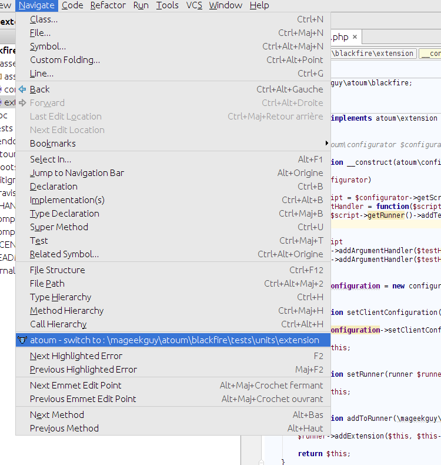
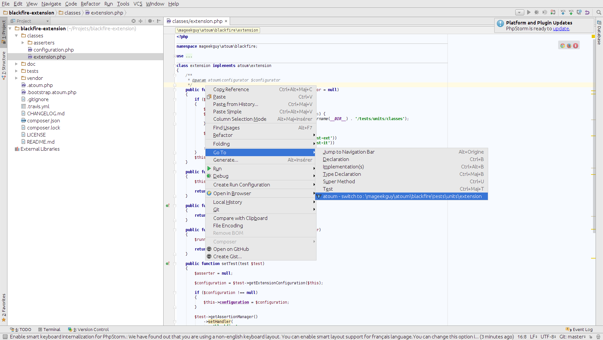
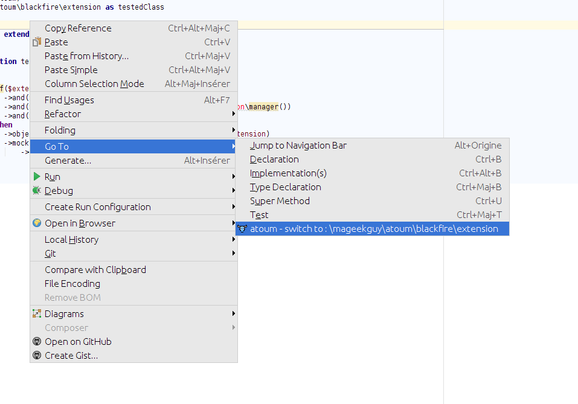

# atoum PHPStorm Plugin

Integrates atoum into PHPStorm

## Features

### Go to the test class from the tested class

* From the tested class you can go to the test class from a menu entry in navigation

* Or by an entry bin the right click menu

### Go to the tested class from the test class

* From the test class you can go to the tested class from a menu entry in navigation

* Or by an entry bin the right click menu

## Links

* [PhpStorm](https://www.jetbrains.com/phpstorm/)
* [atoum](http://atoum.org)
* [atoum's documentation](http://docs.atoum.org)

## Licence

atoum phpstorm-plugin is released under the MIT License. See the bundled LICENSE file for details.
